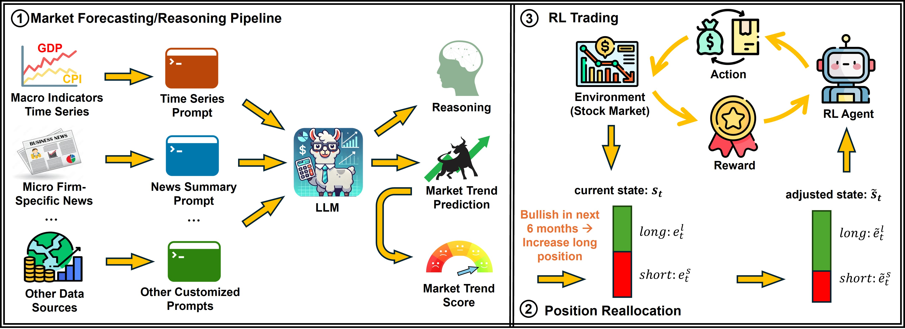

# Adaptive and Explainable Margin Trading via LLM and RL



## Introduction
This project presents an adaptive and explainable framework for portfolio management, integrating Large Language Models (LLMs) with Reinforcement Learning (RL) to dynamically adjust long-short positions in response to market conditions. Our approach leverages recent advancements in LLMs for processing unstructured data and providing transparent reasoning, thereby enhancing decision-making and transparency in financial strategies.

The framework consists of two main stages: an Explainable Market Forecasting/Reasoning Pipeline and a Position Reallocation stage. The Market Forecasting/Reasoning Pipeline utilizes various LLMs to learn market trends from diverse external data sources, providing a clear reasoning path for optimal adjustment ratios. The Position Reallocation stage interacts with a pre-trained RL model to enhance decision-making and transparency throughout the sequential trading process.

Our experiments demonstrate that this framework achieves significant improvements in return and risk metrics compared to benchmarks, showcasing its adaptability and effectiveness in diverse market conditions.

## Key Features
- **Adaptive Adjustments:** Dynamically reallocates funds between long and short positions based on evolving market conditions.
- **Explainable Reasoning:** Provides transparent explanations for market forecasts and position adjustments.
- **Flexible Integration:** Accommodates various external data sources and data types, including time series and textual data.
- **Improved Performance:** Achieves up to three times the return and doubles the Sharpe ratio compared to benchmarks.
- **Publicly Available:** All data and code are publicly available in the data/ folder.

## Framework Overview
### Explainable Market Forecasting/Reasoning Pipeline
- Utilizes LLMs to process diverse external data sources.
- Provides clear reasoning paths for optimal adjustment ratios.
- Flexible to incorporate various LLMs and data types.

### Position Reallocation Stage
- Interacts with a pre-trained RL model to enhance decision-making.
- Regularly adjusts portfolio states for optimal long-short position ratios.
- Enhances transparency and trust in financial decisions.

## Usage
To run the framework, use the following commands:

### Market Forecasting/Reasoning Pipeline
```bash
python inference_open_source_llm.py --model Llama-3-70B
```

### Position Reallocation Stage
```bash
python run_position_reallocation.py
```

## Datasets
### Data Source
The Dow Jones Industrial Average (DJIA) is selected as the portfolio pool. We follow Margin Trader Paper for the training, validation, and testing periods. Note that the test period is extended to 2020/5 - 2024/2 in our paper, as it includes complex economic fluctuations marked by a significant rise (COVID-19 pandemic recovery) and subsequent variations (supply chain disruptions and inflation). The price data of companies in DJIA for RL is sourced from Yahoo Finance.

Additionally, two distinct external data sources are collected and tested to evaluate their impact on near-future (six-month) US market trend prediction:
1. **Macroeconomic Indicator Time Series Dataset:** Comprises monthly time series data for 21 key US economic metrics. The inflation rate data is sourced from the US Inflation Calculator, while the remaining macroeconomic indicators are obtained from the Federal Reserve Bank of St. Louis. Data with daily or quarterly features has been appropriately downsampled or upsampled to a monthly frequency.
2. **Microeconomic Firm-Specific News Dataset:** Includes daily news data specific to the 30 companies listed on the DJIA. News is gathered from various sources, such as company announcements, earnings reports, and other significant events. The data is retrieved by ticker from the Stock News API, which indexes articles and video content from reputable sources including CNBC, Reuters, MarketWatch, Seeking Alpha, Bloomberg, and The Motley Fool.

## Conclusion
Our adaptive and explainable framework for portfolio management represents a significant advancement in financial strategies, offering secure and efficient methods for dynamic long-short position adjustments using LLMs and RL. Its adaptability and transparent reasoning enhance decision-making, ensuring both profitability and stability in diverse market conditions.
